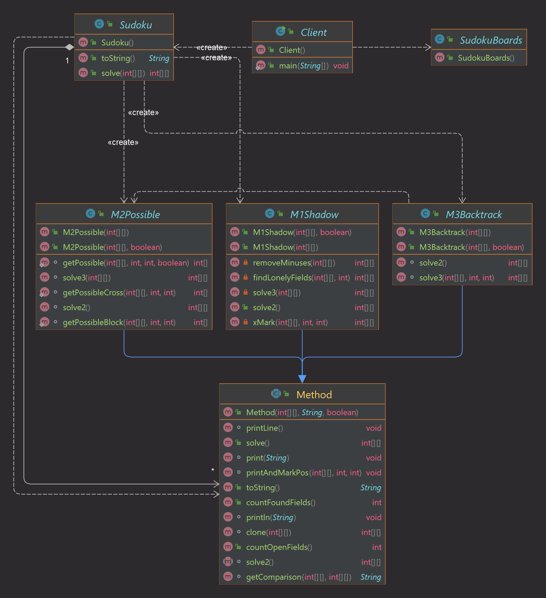

# SudokuSolver

This is an easy Sudoku Solver that takes < 1 sec to solve any Sudoku puzzle.

## Setup

Clone project:

```
git clone https://github.com/interBN/SudokuSolver.git
```

Use Java >=8.

Run the [Client](src/main/java/Client.java).

Have fun.

## Before

```
| -  7  - | 1  -  - | -  -  - |
| -  -  - | -  8  - | 4  -  - |
| -  -  3 | -  6  - | -  -  - |
----------|---------|----------
| -  1  - | -  -  6 | -  -  - |
| -  -  - | 5  -  - | -  9  8 |
| 4  -  - | -  2  1 | -  5  - |
----------|---------|----------
| -  -  - | -  -  - | 7  -  9 |
| -  -  - | 3  -  4 | -  1  - |
| -  6  9 | -  -  - | -  -  3 |
```

## After

```
| 8  7  4 | 1  3  5 | 9  6  2 |
| 1  9  6 | 2  8  7 | 4  3  5 |
| 2  5  3 | 4  6  9 | 8  7  1 |
----------|---------|----------
| 9  1  5 | 8  7  6 | 3  2  4 |
| 6  2  7 | 5  4  3 | 1  9  8 |
| 4  3  8 | 9  2  1 | 6  5  7 |
----------|---------|----------
| 3  4  1 | 6  5  2 | 7  8  9 |
| 7  8  2 | 3  9  4 | 5  1  6 |
| 5  6  9 | 7  1  8 | 2  4  3 |
```

Time to complete this puzzle: 484 ms (depends on system).

## Project Structure


